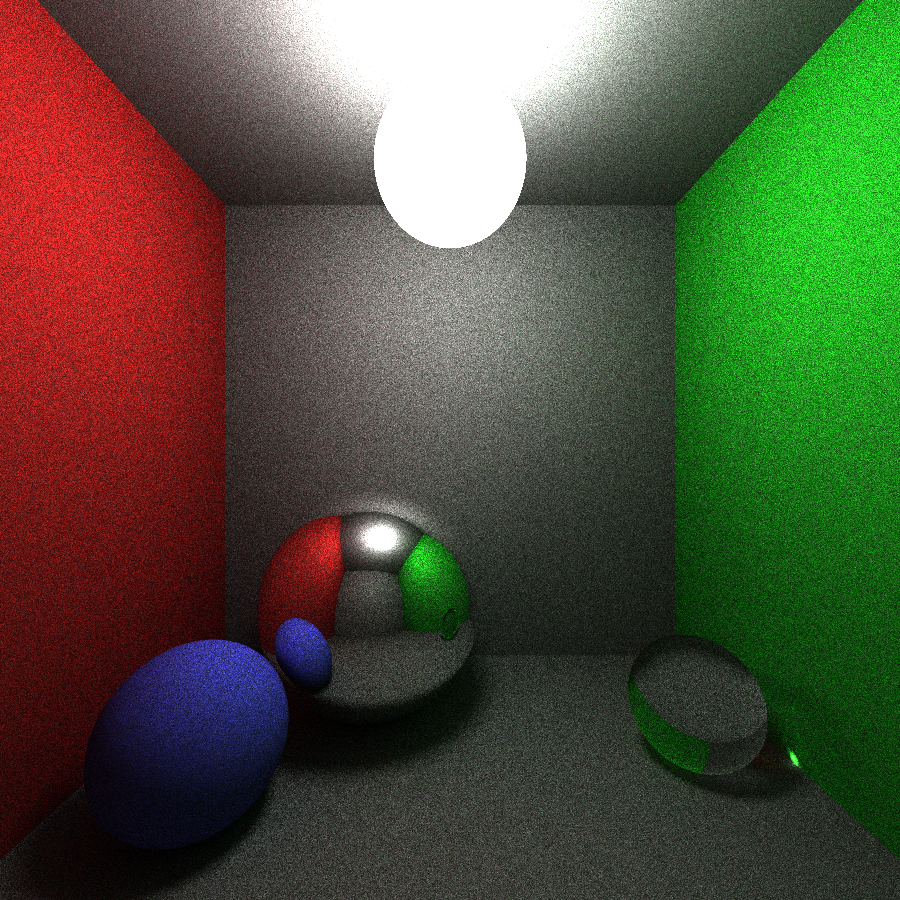

# 🔦 rpath

This is a relatively simple (~400 line) path tracer,
heavily inspired by Károly Zsolnai-Fehér's
[Smallpaint](https://users.cg.tuwien.ac.at/zsolnai/gfx/smallpaint/),
featuring (at the moment) diffuse, specular, and refractive
(glass) materials, sphere and plane geometry, and
Russian roulette stopping.



This example image was generated with 1000 samples per pixel.

Make sure to run in release mode:
```
cargo run --release
```

## Dependencies
* [nalgebra](https://crates.io/crates/nalgebra)
* [rand](https://crates.io/crates/rand)
* [rayon](https://crates.io/crates/rayon)

